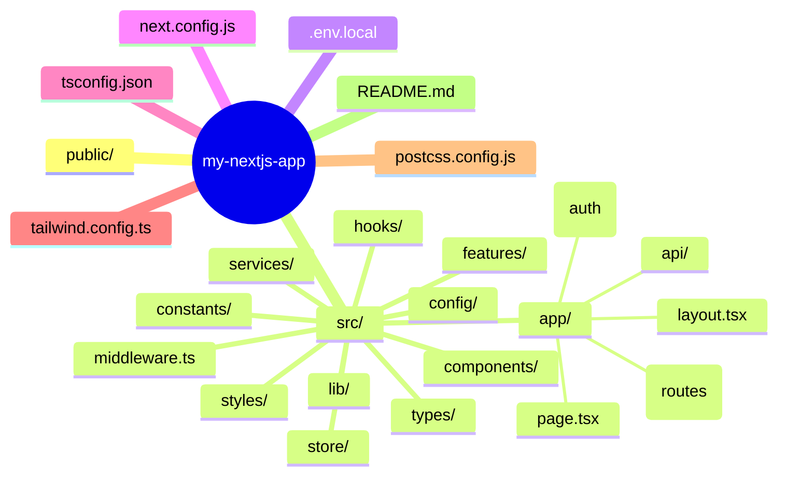

## Folder Structure

---
## 🧭 Explanation

- **`public/`** – Static assets like images, icons, or `robots.txt`.
- **`src/app/`** – Root for routing and layouts in App Router-based structure.
- **`components/`** – Shared UI building blocks, split for clarity (`ui/`, `form/`, `layout/`).
- **`features/`** – Encapsulated features like authentication, dashboard logic, etc.
- **`styles/`** – Tailwind base config or global styles.
- **`lib/`** – Helper functions, formatters, etc.
- **`hooks/`** – Reusable custom React hooks.
- **`types/`** – TypeScript types and interfaces.
- **`constants/`** – Static values, enums, app-level labels.
- **`services/`** – API calls and services using Axios, fetch, etc.
- **`store/`** – Global state management (Zustand, Redux).
- **`config/`** – App-wide configuration like SEO, routes, metadata.
- **`middleware.ts`** – Middleware logic (auth, redirects).
- **`app.tsx`** – Entry point for the app.

---
## React/Next.js Project Standards

- Make a proper flow and then execute.
  - Never work without a flow because when the project scales, new changes can break your improper flow, which creates functional bugs.
- Proper project structure.
- Proper code splitting — max lines 450–500.
- Must have absolute paths.
- Must have ESLint & Husky.
- Use less local state.
- Use Context or Redux state for universal state.
- Less prop drilling.
- Less npm usage.
- No conditioning in common components.
  - If it's any field component, then make sure its change is handled by the parent component.
  - This makes the component more dynamic — we can control it with state or Formik.
- Less npm usage.
  - If it can be done with simple code, never use npm for that — unnecessary npm will drop performance of CI/CD pipeline and the project itself.
- Make sure to write proper comments.
- Use `useCallback` & `memo` to memoize components and heavy functions.
  - Make sure if your component is memoized, it only renders if props change.
  - If you're passing state functions or any other setter functions, which create a new reference every time, it leads to re-renders. Make sure to use `useCallback` on those functions.
- Use common classes for Tailwind/CSS.

