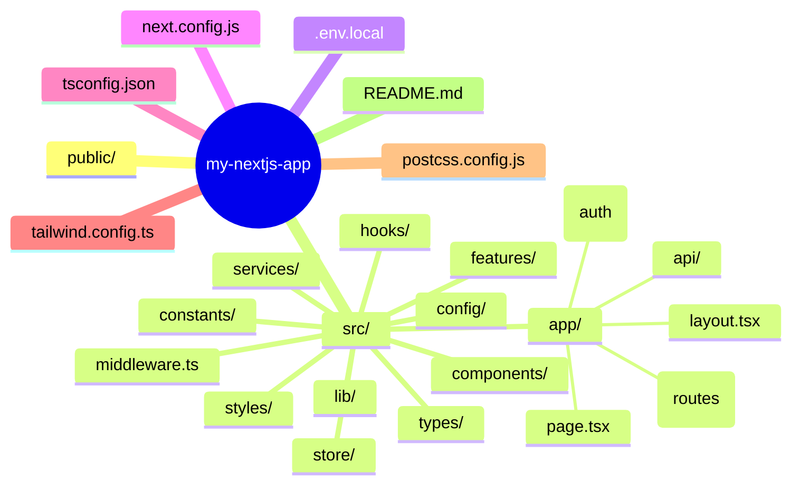

## Folder Structure

---
## 🧭 Explanation

- **`public/`** – Static assets like images, icons, or `robots.txt`.
- **`src/app/`** – Root for routing and layouts in App Router-based structure.
- **`components/`** – Shared UI building blocks, split for clarity (`ui/`, `form/`, `layout/`).
- **`features/`** – Encapsulated features like authentication, dashboard logic, etc.
- **`styles/`** – Tailwind base config or global styles.
- **`lib/`** – Helper functions, formatters, etc.
- **`hooks/`** – Reusable custom React hooks.
- **`types/`** – TypeScript types and interfaces.
- **`constants/`** – Static values, enums, app-level labels.
- **`services/`** – API calls and services using Axios, fetch, etc.
- **`store/`** – Global state management (Zustand, Redux).
- **`config/`** – App-wide configuration like SEO, routes, metadata.
- **`middleware.ts`** – Middleware logic (auth, redirects).
- **`app.tsx`** – Entry point for the app.

